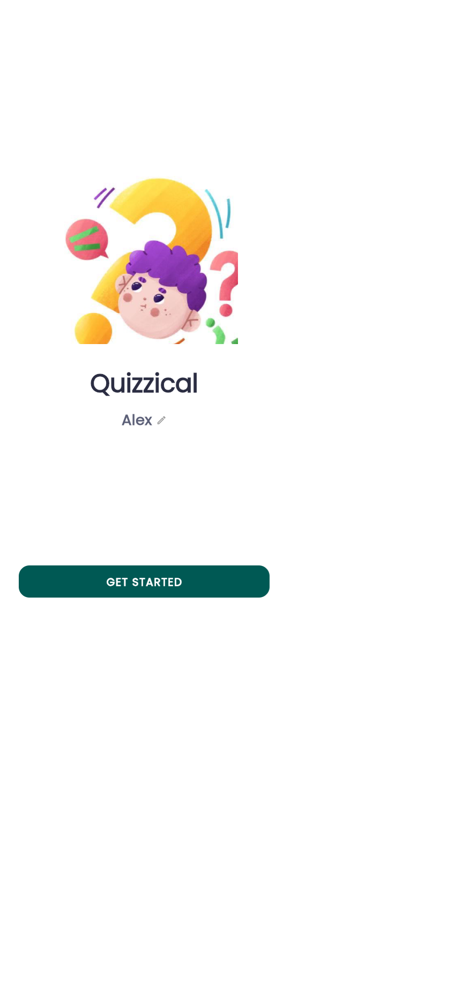
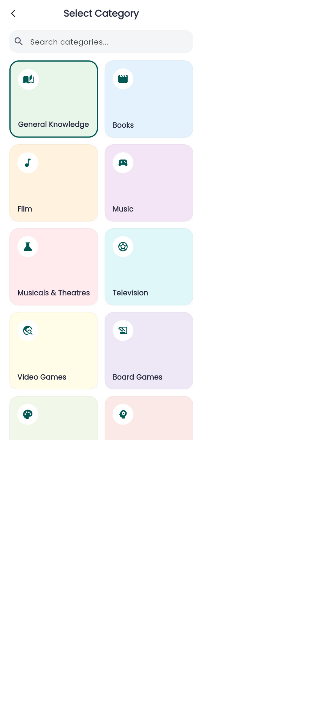
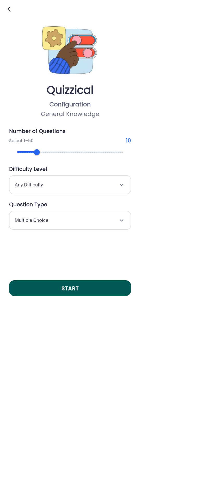
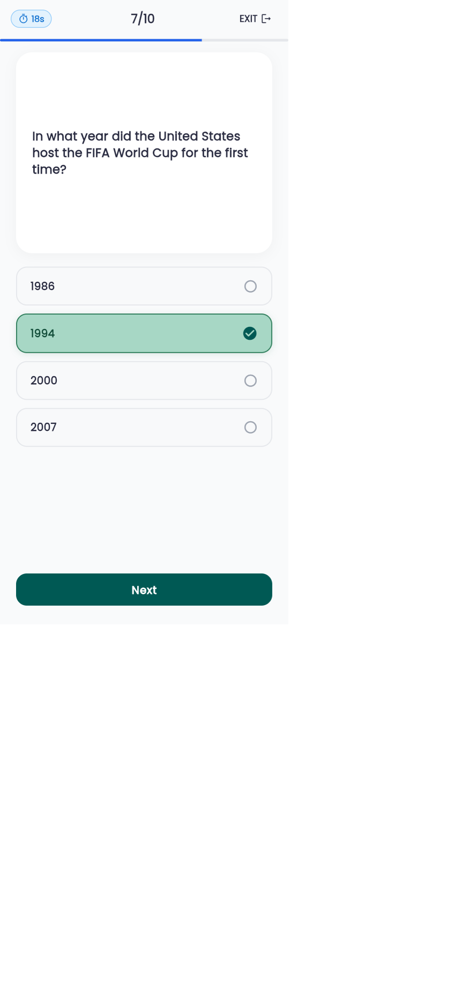
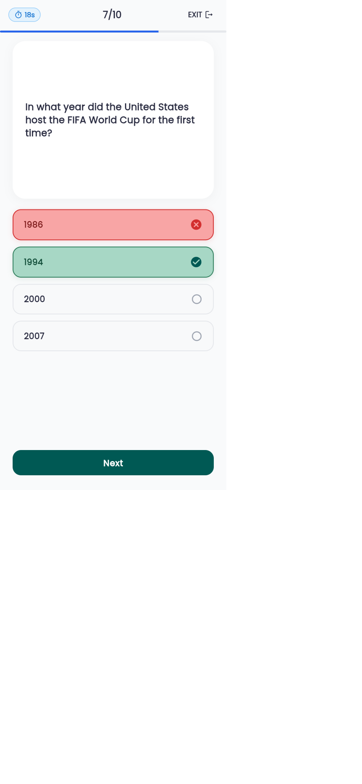
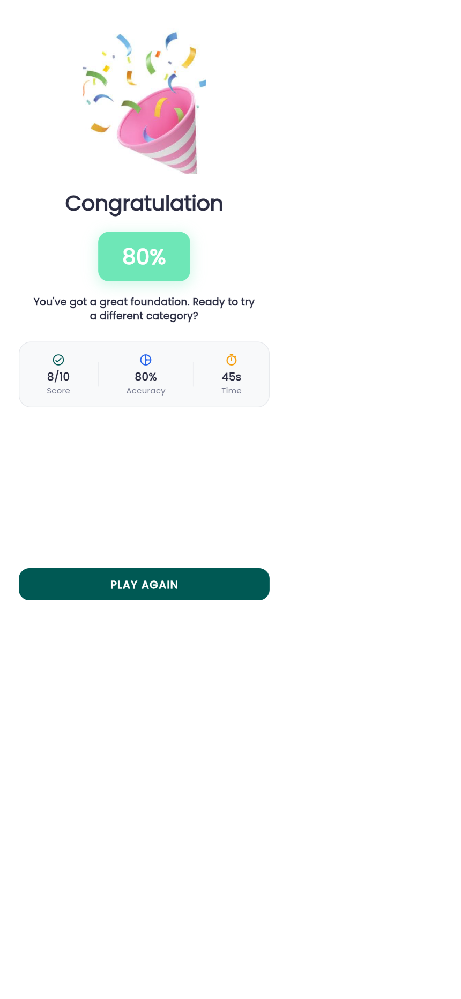
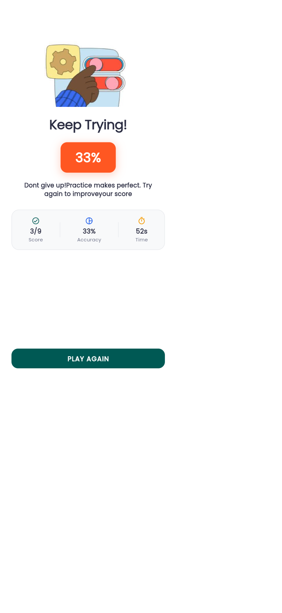

# Quizzical — Mobile Trivia Application 🎯

A clean, responsive, and accessible Flutter trivia application built for the Lab Final Examination. Powered by OpenTDB (Open Trivia Database) with modern state management using Provider, local configuration caching via SharedPreferences, countdown timer, responsive layout, and visual feedback closely following the Figma design specification.

---

## 📱 Application Screenshots

| 1. Welcome Screen | 2. Category Selection | 3. Quiz Configuration |
| :---: | :---: | :---: |
|  |  |  |

| 4. Correct Answer Feedback | 5. Incorrect Answer Feedback | 6. Result (Congratulation) | 7. Result (Keep Trying) |
| :---: | :---: | :---: | :---: |
|  |  |  |  |

---

## 🎥 App Demo Video
The project includes a full screen recording demonstration of the live app playthrough:
- **Location:** `demo/quizzical_demo.webm` (also at `../quizzical_demo.webm`)

---

## 🚀 Core Features & Screen Implementations

### 1. Screen 1 — Welcome Screen (`lib/screens/welcome_screen.dart`)
- **First Impression & Entry Point**:
  - Displays original custom illustration and "Quizzical" brand title.
  - Personalized profile name with live editing dialog.
  - Primary CTA button `"GET STARTED"` with responsive pill styling.
  - Adaptive layout adapting to all mobile and desktop aspect ratios.

### 2. Screen 2 — Category Selection (`lib/screens/category_screen.dart`)
- **Dynamic Trivia Categories**:
  - Fetched from OpenTDB (`https://opentdb.com/api_category.php`).
  - Session Caching: Categories are fetched once and cached in-memory during the session.
  - Live search bar filtering categories instantaneously.
  - Dynamic grid of cards with pastel background color palettes and icons.
  - Shimmer/skeleton loading placeholder and error banner with retry capability.
  - Tapping navigates to Quiz Configuration with the selected category ID and name.

### 3. Screen 3 — Quiz Configuration & Play Screen
#### Configuration (`lib/screens/quiz_config_screen.dart`)
- Amount slider: Range 1–50 (default: 10) with live counter badge.
- Difficulty dropdown: `Any Difficulty`, `Easy`, `Medium`, `Hard`.
- Question type dropdown: `Multiple Choice`, `True / False`, `Any Type`.
- Start button initiating API fetch.
- Saves and restores last configuration via `SharedPreferences`.

#### Gameplay (`lib/screens/quiz_play_screen.dart`)
- Fetches questions dynamically via `https://opentdb.com/api.php?amount=<n>&category=<id>&difficulty=<level>&type=<type>`.
- HTML entity decoding for clean text (e.g. `&quot;`, `&#039;` -> `"`, `'`).
- Shuffled answer buttons (4 for multiple choice, 2 for boolean), ensuring exactly one correct answer.
- 20-second countdown timer per question.
- Visual feedback on selection:
  - Correct answer highlighted in soft mint green with checkmark badge (`#A7D7C5`).
  - Incorrect answer highlighted in soft coral red with cross badge (`#F8A5A5`).
- Live score tracking and dynamic progress bar.
- Safe exit confirmation dialog preventing accidental exits.

### 4. Screen 4 — Results Screen (`lib/screens/result_screen.dart`)
- Dynamic outcome states:
  - High score ($\ge 60\%$): Celebration confetti illustration, vibrant glowing pill badge (`80%`), motivational message.
  - Low score ($< 60\%$): Settings illustration, orange badge (`33%`), encouraging feedback.
- Quick Stats Breakdown: Score ratio (`8/10`), Accuracy percentage (`80%`), and Total time taken (`45s`).
- CTA `"PLAY AGAIN"` resets quiz session while preserving saved preferences.

---

## 🛠️ Architecture & Tech Stack

- **Flutter SDK**: 3.47.5 (Dart 3.13.4)
- **State Management**: `provider: ^6.1.5`
- **Networking**: `http: ^1.6.0`
- **Local Storage**: `shared_preferences: ^2.5.5`
- **Typography & UI**: `google_fonts: ^8.2.1`, `cupertino_icons: ^1.0.8`
- **Decoding**: `html_unescape: ^2.0.0`

### Project Structure
```text
lib/
├── main.dart                      # App entry point & routing
├── models/
│   ├── category.dart              # Category model with styling
│   ├── question.dart              # Question model with HTML decoding
│   └── quiz_config.dart           # Configuration model & serialization
├── providers/
│   └── quiz_provider.dart         # Core ChangeNotifier business logic
├── screens/
│   ├── welcome_screen.dart        # Screen 1: Welcome
│   ├── category_screen.dart       # Screen 2: Category selection
│   ├── quiz_config_screen.dart    # Screen 3A: Quiz configuration
│   ├── quiz_play_screen.dart      # Screen 3B: Interactive quiz & timer
│   └── result_screen.dart         # Screen 4: Results & stats
├── services/
│   ├── api_service.dart           # OpenTDB API with fallback
│   └── preferences_service.dart   # SharedPreferences persistence
└── theme/
    └── app_theme.dart             # Figma color schemes & typography
```

---

## 🧪 Testing

The repository contains unit, widget, and integration tests verifying all 4 screens and state transitions:

```bash
flutter test
```
Result: **5/5 tests passing** (0 issues).

---

## 🏃 How to Run Locally

1. **Clone the repository:**
   ```bash
   git clone <YOUR_GITHUB_REPO_URL>
   cd quizzical
   ```

2. **Get dependencies:**
   ```bash
   flutter pub get
   ```

3. **Run the app:**
   - On Chrome (Web):
     ```bash
     flutter run -d chrome
     ```
   - On Windows (Desktop):
     ```bash
     flutter run -d windows
     ```
   - On Connected Mobile Device / Emulator:
     ```bash
     flutter run
     ```
